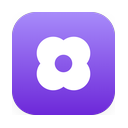
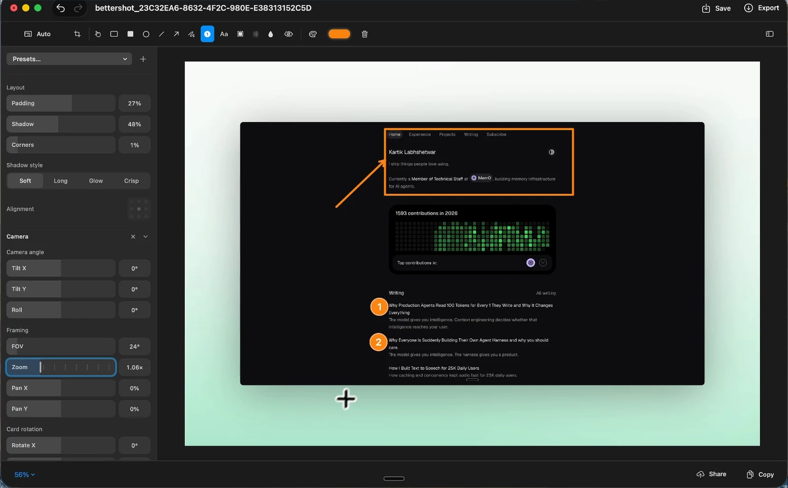
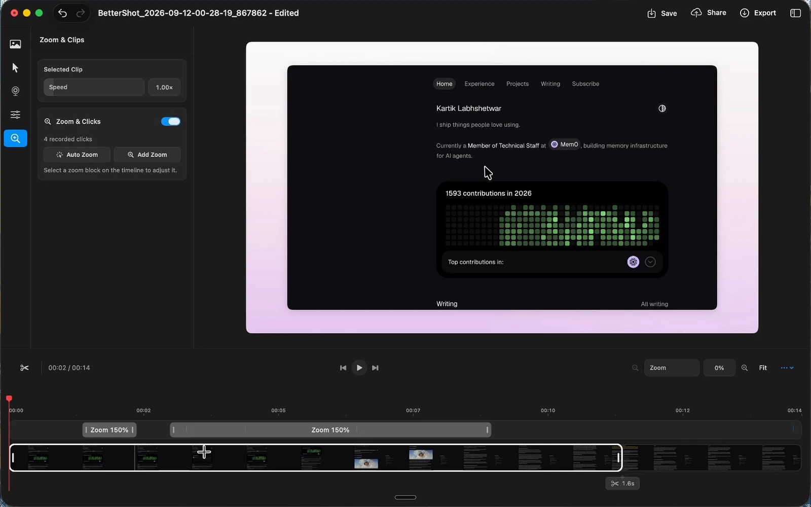

<p align="center">
  
</p>

<h1 align="center">BetterShot</h1>

<p align="center">
  <strong>Capture, edit, and share your screen. Native on macOS.</strong>
</p>

<p align="center">
  <a href="https://github.com/KartikLabhshetwar/better-shot/releases/latest"></a>
  
  <a href="https://github.com/KartikLabhshetwar/better-shot/actions/workflows/build.yml"></a>
  <a href="LICENSE"></a>
</p>

<p align="center">
  <a href="https://github.com/KartikLabhshetwar/better-shot/releases/latest">Download</a> ·
  <a href="https://bettershot.site">Website</a> ·
  <a href="CHANGELOG.md">Changelog</a> ·
  <a href="CONTRIBUTING.md">Contribute</a> ·
  <a href="https://github.com/KartikLabhshetwar/better-shot/issues">Report a bug</a>
</p>

BetterShot is a free, open-source Mac app for screenshots, scrolling captures,
screen recordings, and image and video editing. No account, subscription, or
cloud service required.



## Install

Requires macOS 26 or later.

```bash
brew install --cask bettershot
```

Or download the Apple silicon or Intel `.dmg` from
[Releases](https://github.com/KartikLabhshetwar/better-shot/releases/latest),
drag BetterShot into Applications, and open it. A short tour walks you through
permissions and your first capture.

## Features

**Screenshots**
- Region, window, fullscreen, and [scrolling](#scrolling-capture) capture.
- Extract text with OCR or pick any on-screen color as hex.
- Annotate with arrows, shapes, text, numbered markers, highlights, blur, and pixelate.
- Crop, rotate, and flip without losing editable annotations.
- Frame captures on a wallpaper, soft gradient, or any custom color with padding, rounded corners, and shadow.
- Save as PNG or JPEG.

**Recordings**
- Record a display, window, or adjustable area with optional system audio, microphone, camera, and teleprompter.
- Pause, restart, or discard from the compact recording bar. Restart and Discard ask for confirmation in a native macOS dialog; Cancel keeps the recording.

**Video editor**
- Cut clips, change speed from 0.25x to 8x, and add zooms, transitions, captions, and blur or pixelate masks.
- Arrange screen and camera as Camera Bubble, Overlap, Side-by-Side, Presenter, Camera Only, or Screen Only.
- Restyle the cursor (Recorded, Arrow, Dark, Light, Dot) with size, smoothing, click effects, and idle hiding.
- Add 3D shots: eight camera moves, five drifting angles, Auto Scene, depth blur, and keyframed Bézier curves.
- Export MP4 or MOV at 30 or 60 fps.

**Everything else**
- Copy, save, pin, edit, share, or drag captures from the floating preview.
- Browse screenshots, recordings, and share links in the Media Gallery.
- Share to [your own Cloudflare R2 bucket](#cloud-sharing) with one click.
- Trigger any capture from Shortcuts, Raycast, or the terminal with [URL actions](#automation).

Original captures and source movies are never modified. Both editors support
undo, redo, and native full screen.

<details>
<summary>See the video editor</summary>



</details>

## Getting started

1. Open BetterShot and allow Screen Recording. Enable Accessibility for global shortcuts.
2. Press `⌘⇧4` to capture a region, or `⌘⇧2` to open the capture and recording bar.
   Your last area opens already selected: press Return to capture it again, drag
   its edges to resize it, or drag anywhere to draw a new one.
3. Use the floating preview to Copy, Save, Pin, Edit, or Share.

| Action | Shortcut |
| --- | --- |
| Region screenshot | `⌘⇧4` |
| Capture previous region again | `⌘⇧1` |
| Fullscreen screenshot | `⌘⇧3` |
| Capture and recording bar | `⌘⇧2` |
| Recording options | `⌘⇧5` |
| OCR text scan | `⌘⇧O` |
| Color picker | `⌘⇧C` |

Change or add bindings in **Settings > Shortcuts**. Extra actions, such as
Capture Region & Pin or Edit Clipboard Image, start unassigned.

Set the background, padding, corner radius, and shadow for new captures in
**Settings > General > Default Look**.

Region screenshots use BetterShot’s adjustable selector. In
**Settings > Capture > Region**, **Freeze & Select** captures the displays before
selection and saves the selected pixels from that frozen image. **Live Selection**
keeps the displays live and captures after confirmation. Both modes remember the
last area and support adjustment. Enable **Capture as soon as I let go** to confirm
on mouse release. Window screenshots and OCR use the native macOS selectors.
OCR recognizes Simplified Chinese, Traditional Chinese, and English. The app
interface follows the system language, with English and Simplified Chinese resources
for capture controls, Settings, the media gallery, and image and video editors.
User-entered names, captions, file names, and historical release notes retain their
original content.

Saved previews dismiss after **Settings > Overlay > Hide After**, pausing while
you use the card. **Keep screenshot previews open** holds only unsaved captures;
choose **Never** under Hide After to keep saved previews open too.

### Scrolling capture

Capture a page or list taller than the screen:

1. Choose **Scrolling Capture** in the menu bar, **Scroll** in the capture bar
   (`⌘⇧2`), or assign a shortcut in **Settings > Shortcuts**.
2. Drag over the scrollable content, then scroll down through it. Or click
   **Auto Scroll** to let BetterShot scroll for you (requires Accessibility).
3. Click **Stop** to send the stitched image to the capture preview. **×** or
   Escape discards it.

Fixed headers and scrollbars are left out of the joins, and content that fades
in while scrolling is captured fully drawn. Captures finish at 30,000 pixels.
If a join is missed, scroll back up a little and continue.

### Where files go

| Action | Result |
| --- | --- |
| **Copy** | Puts the image on the clipboard. No extra file is exported. |
| **Save** | Writes to your configured folder. Later saves from the editor update the same file. |
| **Export** | Asks for a new destination. |

New installs also save every normal screenshot to the configured folder
(Desktop by default). Turn this off under **Settings > General > Saving** to
keep captures private until you choose Save or Export. Upgrades keep your
previous behavior. Capture & Copy, Edit, and Pin shortcuts always skip
automatic saving, and a failed save keeps the capture available for retry.

Each capture is named once, when it is taken, and every action reuses that
name. Customize it in **Settings > General > Saving** with templates such as
`standup-{date}-{counter:3}`.

### Permissions

| Permission | Used for |
| --- | --- |
| Screen & System Audio Recording | Screenshots, recordings, and system audio |
| Accessibility | Global shortcuts |
| Input Monitoring | Cursor effects and shortcut overlays. Plain typing is never recorded. |
| Microphone | Voice in recordings |
| Camera | Camera recording |

Manage access in **System Settings > Privacy & Security**. If capture or
shortcuts still fail after granting access, quit and reopen BetterShot.

## Cloud sharing

Sharing is optional and uses a Cloudflare R2 bucket you own.

1. Create an R2 bucket with a public URL and an
   [API token](https://developers.cloudflare.com/r2/api/tokens/) with
   Object Read & Write access to that bucket.
2. Enter your credentials in **Settings > Sharing** and click **Test Connection**.
   A successful test turns on **Upload when I share**; while it is off, Share
   uploads nothing.
3. Click **Share** on any capture to upload it and copy the link.

Credentials are stored in your login Keychain. Links open a viewer on
`bettershot.site` by default. Turn on **Copy direct file links** to get the raw
file URL instead. Anyone with a link can view it. Outside of sharing, BetterShot
only goes online to check GitHub for updates.

## Automation

Trigger captures from Shortcuts, Raycast, Alfred, or the terminal:

```bash
open 'bettershot://capture/region'
```

| Route | Action |
| --- | --- |
| `capture/region` | Region screenshot |
| `capture/fullscreen` | Fullscreen screenshot |
| `capture/window` | Window screenshot |
| `capture/scroll` | Scrolling capture |
| `ocr` | OCR text scan |
| `color-picker` | Color picker |
| `record` | Start a recording |
| `settings` | Open Settings |

## Build from source

Requires Xcode 26 and [XcodeGen](https://github.com/yonaskolb/XcodeGen).

```bash
brew install xcodegen
git clone https://github.com/KartikLabhshetwar/better-shot.git
cd better-shot
make release
open .build/Build/Products/Release/BetterShot.app
```

`make release` builds unsigned, so no signing identity is needed. See
[CONTRIBUTING.md](CONTRIBUTING.md) for Xcode setup, the code map, and tests.

## Contributing

Bug reports, fixes, docs, and accessibility feedback are all welcome. When
[opening an issue](https://github.com/KartikLabhshetwar/better-shot/issues),
include your macOS and BetterShot versions and steps to reproduce. Read the
[contributor guide](CONTRIBUTING.md) and [Code of Conduct](CODE_OF_CONDUCT.md)
before opening a pull request.

Built by [Kartik Labhshetwar](https://x.com/code_kartik) and
[contributors](https://github.com/KartikLabhshetwar/better-shot/graphs/contributors).
If BetterShot helps you, consider [supporting its development](https://www.buymeacoffee.com/code_kartik).
